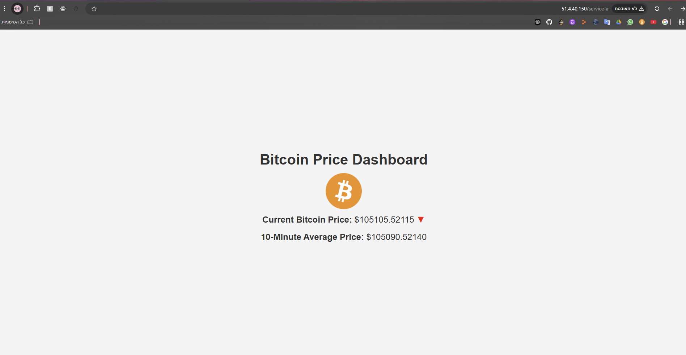
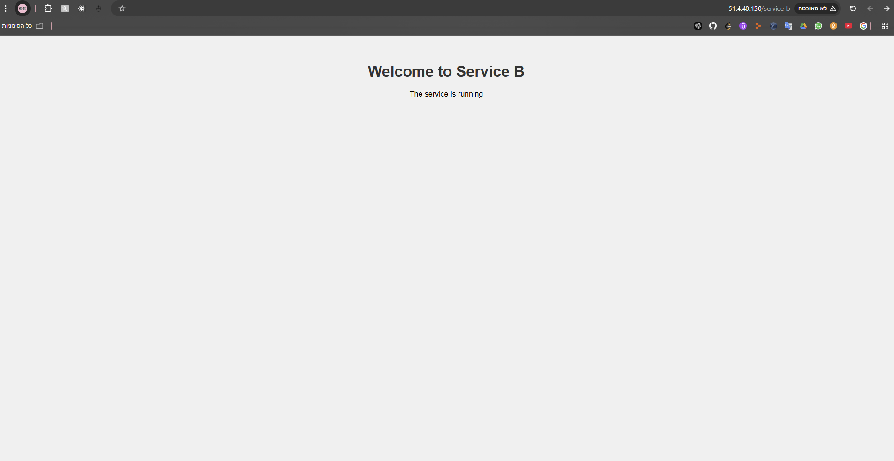

# K8s Bitcoin Price Fetcher and Service Deployment

## Overview

This project demonstrates the deployment of a Kubernetes (K8s) cluster using Azure Kubernetes Service (AKS) with two services: **Service-A** and **Service-B**. Service-A is a Python-based application that fetches Bitcoin prices from an external API, while Service-B serves a static web page. The cluster is set up with production-ready features, including an Ingress controller, RBAC, network isolation, and health checks.

---


## Cluster Details

### 1. **Use Azure and AKS**
The Kubernetes cluster was created using Azure Kubernetes Service (AKS) with RBAC enabled and a single-node setup.

#### **Commands Used**:
```bash
-az login
-az group create --name k8sResourceGroup --location israelcentral
-az provider register --namespace Microsoft.ContainerService
-az provider show --namespace Microsoft.ContainerService --query "registrationState" -o table
-az aks create --resource-group k8sResourceGroup --name myAKSCluster --node-count 1 --enable-managed-identity --generate-ssh-keys
```
---

### 2. **Set up K8S Cluster with RBAC Enabled**
RBAC was enabled during the cluster creation process, ensuring secure management of resources.

Verification Command:<br>
```bash
az aks show --resource-group k8sResourceGroup --name myAKSCluster --query enableRbac --output table
```
---

### 3. **Two Services: Service-A and Service-B**
Service-A:
A Python application that:
   - Fetches Bitcoin prices from the CoinCap API every minute.
   - Calculates and prints the 10-minute average.
   - Dynamically updates an index.html file with price information and trends.
Service-B:
   - An NGINX-based service with a custom index.html file displaying "Welcome to Service B."

#### **Commands Used**:
```bash
- kubectl apply -f k8s/deployments/a-deployment.yaml
- kubectl apply -f k8s/services/a-service.yaml
- kubectl apply -f k8s/deployments/b-deployment.yaml
- kubectl apply -f k8s/services/b-service.yaml
```
---
### 4. **Ingress Controller**
An NGINX Ingress controller was configured to route traffic to both services:

    /service-a redirects to Service-A.
    /service-b redirects to Service-B.

#### **Commands Used**:
```bash
kubectl apply -f k8s/ingress.yaml
```
---

### 5. **Network Policy**
A network policy was applied to restrict communication between Service-A and Service-B.

#### **Commands Used**:
```bash
kubectl apply -f k8s/deny-com-policy.yaml
```
#### **Testing**:
```bash
kubectl exec -it <service-a-pod> -- curl http://service-b 
# Expected result: Connection timeout
```
---
### 6. **Service-A Application**
- Fetches Bitcoin prices in USD every minute and prints them to the console.
- Calculates the average price for the last 10 minutes and logs it.
- Updates a dynamic web page with the price and trends.

### Service-A Snapshot


--- 
#### **Commands Used**:<br>
```bash
- docker build -t natashak8sregistry.azurecr.io/bitcoin-fetcher:latest ./app
- docker push natashak8sregistry.azurecr.io/bitcoin-fetcher:latest
```
---
###  **General Guidelines**

- Automated Deployment:
All resources are defined in YAML files for repeatability.<br>
- Liveness and Readiness Probes:
Configured for both services to ensure health checks and auto-recovery.<br>
- Network Isolation:
- Implemented via Kubernetes Network Policies to restrict unnecessary communication.

---
###  **Project Folder Structure**
```
├───app
│   │   bitcoin_fetcher.py
│   │   Dockerfile
│   │   favicon.ico
│   │   requirements.txt
│   │
│   └───service-b
│           Dockerfile
│           index.html
│
└───k8s
    │   deny-com-policy.yaml
    │   ingress.yaml
    │
    ├───deployments
    │       a-deployment.yaml
    │       b-deployment.yaml
    │
    └───services
            a-service.yaml
            b-service.yaml
```
---

### Service-B Snapshot



---
For questions, reach out to kataev.nat@gmail.com.
